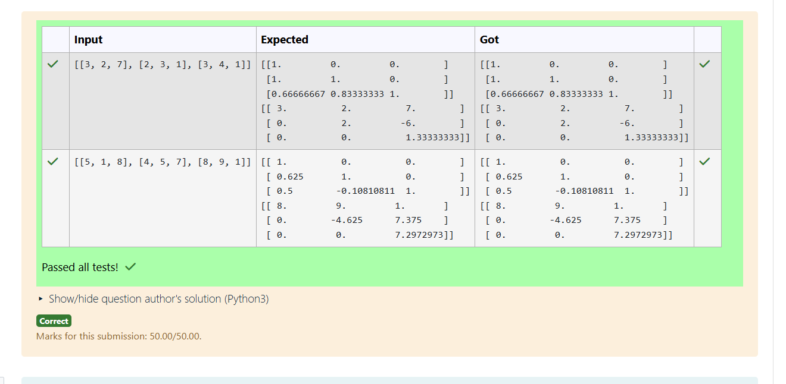
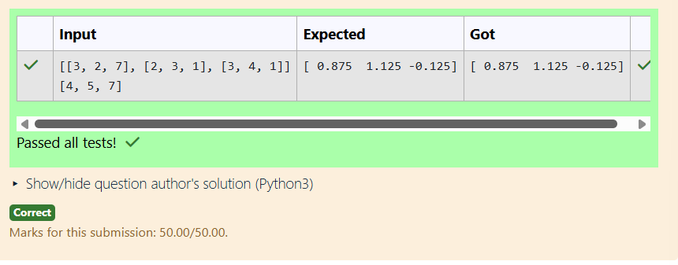

# LU Decomposition 

## AIM:
To write a program to find the LU Decomposition of a matrix.

## Equipments Required:
1. Hardware – PCs
2. Anaconda – Python 3.7 Installation / Moodle-Code Runner

## Algorithm
1. Import the numpy module to use the built-in functions for calculation

2. Prepare the lists from each linear equations and assign in np.array()

3. Using the np.linalg.solve(), we can find the solutions.

4. End the program
## Program:
(i) To find the L and U matrix
/*
Program to find the L and U matrix.
Developed by: GOPIKA G
RegisterNumber: 212225230081
*/
```
import os
os.environ["OPENBLAS_NUM_THREADS"]="1"
import numpy as np
from scipy.linalg import lu
matrix = np.array(eval(input()))
P,L,U=lu(matrix)
print(L)
print(U)

```
(ii) To find the LU Decomposition of a matrix

/*
Program to find the LU Decomposition of a matrix.
Developed by: GOPIKA G
RegisterNumber: 212225230081
*/
```
import os
os.environ["OPENBLAS_NUM_THREADS"]="1"
# To print X matrix (solution to the equations)
import numpy as np
from scipy.linalg import lu_factor,lu_solve
matrix=np.array(eval(input()))
constant=np.array(eval(input()))
piv,lu=lu_factor(matrix)
result=lu_solve((piv,lu),constant)
print(result)
```

## Output:



## Result:
Thus the program to find the LU Decomposition of a matrix is written and verified using python programming.

